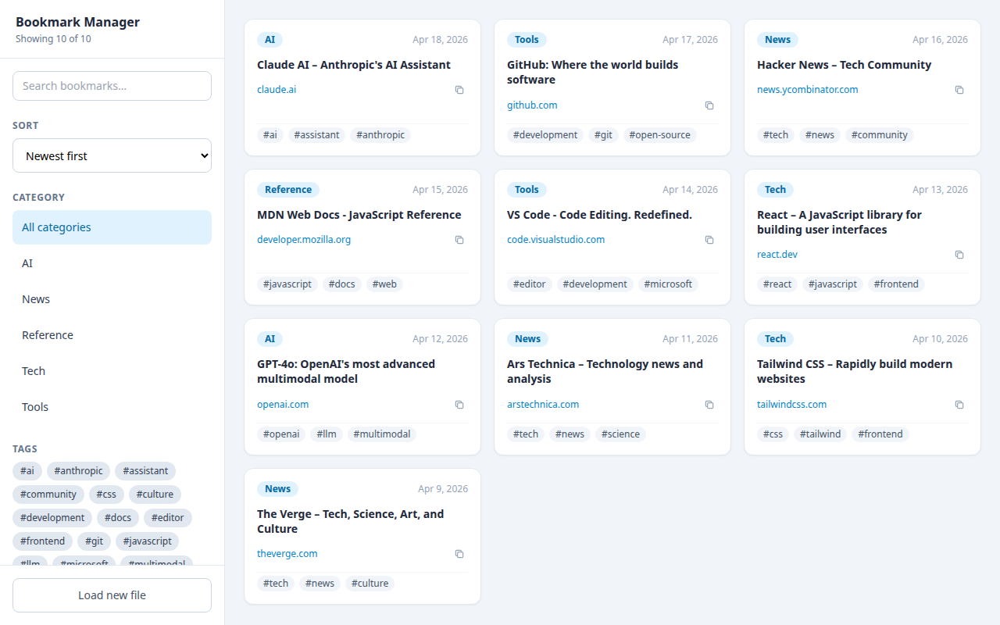
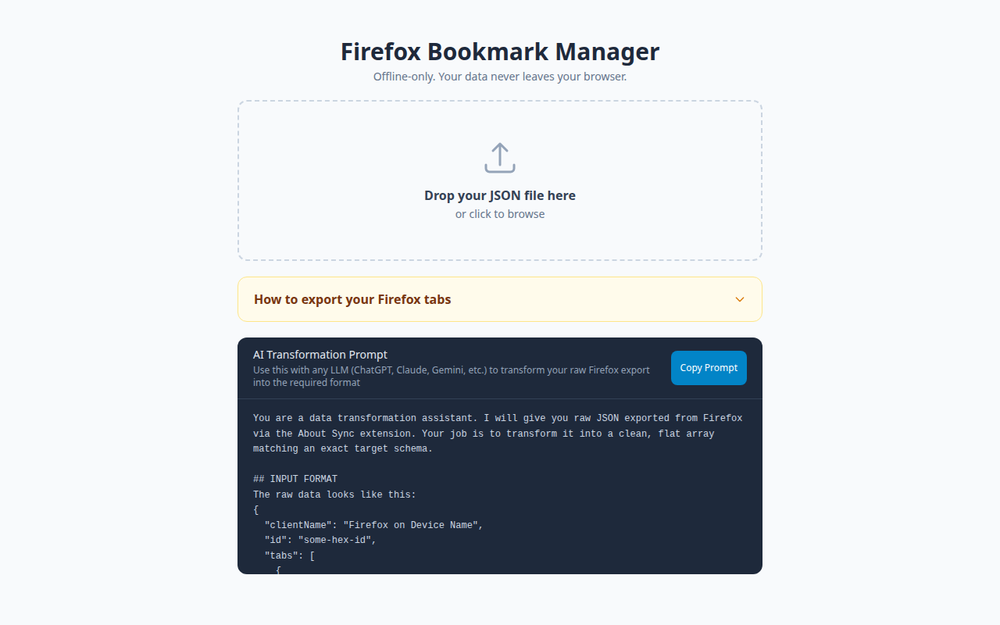

# Firefox Bookmark Manager

A client-side bookmark manager for Firefox synced tabs. Fully offline — your data never leaves your browser.

**[Live Demo →](https://skylark95.github.io/firefox-bookmark-manager/)**



## How it works

Firefox doesn't expose its synced tab data in any useful way. This app bridges that gap:

1. Use the [About Sync](https://github.com/mozilla-extensions/aboutsync) Firefox extension to export your raw synced tab JSON
2. Feed it through the built-in AI prompt to transform it into the required format
3. Upload the result — the app loads it into `localStorage` and you're done

No server, no account, no data transmission. Everything stays in your browser.

## Getting started

### 1. Export your Firefox tabs

Install the [About Sync](https://github.com/mozilla-extensions/aboutsync) extension, then:

1. Open `about:sync` in a new tab
2. Scroll to **tabs** under Collections
3. Click **Record Editor (server)**
4. Select your device from the **Select record** dropdown
5. Copy the JSON from the text box

### 2. Transform the data

The raw export doesn't match the required format. The app includes a built-in AI prompt (visible on the upload screen) that transforms it — paste it into any LLM (ChatGPT, Claude, Gemini, etc.) along with your raw JSON.



### 3. Upload and browse

Upload the transformed JSON file. The app saves it to `localStorage` and renders your bookmarks with full-text search, category filtering, and tag filtering.

## Data schema

The app expects a JSON array. Each item must have:

```json
{
  "id": "string",
  "title": "string",
  "url": "string",
  "lastUsed": 1776529824,
  "category": "string",
  "tags": ["string"]
}
```

`lastUsed` is a Unix timestamp in **seconds** (not milliseconds). The LLM prompt handles this automatically.

## Features

- **Search** — split on spaces; every term must appear in the title or URL
- **Category filter** — click a category in the sidebar or on any card badge
- **Tag filter** — click tags in the sidebar cloud or on card badges; all selected tags must match
- **Sort** — newest first, oldest first, or A–Z by title
- **Filter persistence** — active filters survive page reloads
- **Copy URL** — clipboard button on every card
- **Mobile** — responsive layout with a collapsible sidebar drawer

## Development

Uses [bun](https://bun.sh).

```bash
bun install
bun run dev      # http://localhost:5173
bun run build    # production build → dist/
bun run preview  # preview the build locally
```

## Deployment

The live site deploys automatically via GitHub Actions on every push to `main`. See [`.github/workflows/deploy.yml`](.github/workflows/deploy.yml).

To deploy manually: push to `main` and the workflow handles the rest. Make sure GitHub Pages is configured to use **GitHub Actions** as the source (Settings → Pages → Source).
